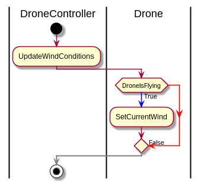

# Table of Contents

1.  [How I immagine the simulation to works](#orgacbfe1a)
    1.  [A bad State machine diagram](#org0d0bb18)
    2.  [Start new mission](#orge8395a1)
    3.  [Check drone arrived to target](#orgab243be)
    4.  [Check completed mission](#org00f363e)
    5.  [Update wind conditions](#orgdcb777f)
    6.  [Update Drone position](#org6e4a1d0)

# How I immagine the simulation to works

There are two main task, generating events and processing events.
The simulation ends whene there are no more clock events.

-   A clock event is just a normal advancment of time in the simulation.
-   The wind event is random and can happen or not during the current time.
-   The mission event is generated only if there is a mission scheduled for that particular clock time.

The simulations end when the simulator reach the max ammount of time

## A bad State machine diagram

## Start new mission

## Check drone arrived to target

## Check completed mission

## Update wind conditions

## Update Drone position

